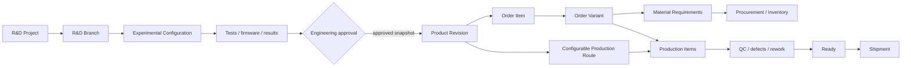

# BAZA — цільова архітектура R&D і виробництва

> Статус: **Phase 0 затверджено; доменні Phase 1–5 та етапи rework 0–5 реалізовано**.
> Документ описує цільову модель за `CODEX_PRODUCT_SPEC.md`. Поточна additive схема `0001–0014`
> зберігає сумісність із наявними даними; наступними є етапи якості, відвантаження та складу.

## Архітектурне рішення

BAZA залишається modular monolith: один FastAPI застосунок, один React
застосунок, одна PostgreSQL база та storage abstraction для файлів. Нові
предметні модулі додаються всередині моноліту. Microservices, broker, Redis,
Elasticsearch і background queue для першої виробничої версії не потрібні.

Архітектура є розширюваною: чотири top-level business modules — `R&D`,
`Products`, `Production`, `Inventory` — є UX-рішенням, а не обмеженням коду.
Нова capability додається всередині відповідного domain module; новий domain
module створюється лише для окремої business area. Майбутні Service/Repairs,
Calibration, Maintenance, analytics, supplier portal або equipment management
не реалізуються зараз, але не повинні вимагати переписування існуючих доменів.

Обов'язкові межі понять:

- `R&D Project` не є `Product`.
- `R&D Branch` не є `Product Revision`.
- поточний `Setup` стає R&D `Configuration`, а не production revision.
- `SetupComponent` є experimental BOM. Production BOM — окремий immutable
  snapshot у `ProductRevisionBomItem`.
- `FirmwareRevision` не замінює `ProductRevision`.
- тимчасова заміна змінює `OrderVariant`, а не базову ревізію.

## Оцінка поточного репозиторію

| Поточна частина | Стан | Рішення |
|---|---|---|
| FastAPI factory, routers/services, SQLAlchemy session | Працює | Зберегти; rules у services, HTTP у routers |
| Alembic `0001–0006`, UUID, timestamptz, PostgreSQL constraints | Працює | Не переписувати; тільки нові additive migrations |
| JWT cookie, CSRF/origin, Argon2, auth sessions | Працює | Зберегти; login перевести з email на username, single-role checks — на capabilities |
| `User.role` ADMIN/MANAGER/ENGINEER/EMPLOYEE | Не відповідає spec | Додати `roles` + `user_roles`, backfill і dual-read; не видаляти колонку одразу |
| Projects, members, tasks, Kanban | Добра R&D основа | Зберегти UUID/дані; додати goal/dates і branch links |
| Setups і SetupComponent | Working experimental configuration | Поступово перейменувати в домені/UX; додати generic attributes і branch context |
| Components | Придатний каталог | Зберегти; додати SKU/default UOM/lifecycle та inventory interfaces |
| Tests, equipment, measurements, charts | Сильна R&D база | Зберегти; додати branch/production-stage links і generic test types |
| Firmware revisions | Append-only | Зберегти; Product Revision посилається через firmware requirements |
| Files + LocalStorage | Відповідає spec | Зберегти protocol/security; розширювати owner FK і XOR constraint |
| Comments, search, dashboard | Придатна інфраструктура | Розширити access predicates і role-specific read models |
| React Router/Query/forms/tables/badges/charts | Придатний shell | Зберегти; sidebar згрупувати у 4 модулі, додати worker flow |
| Sidebar Projects/Tasks/Setups/Components/Tests | Не відповідає spec | Перемістити у tabs R&D/Products/Production/Inventory |
| Products/revisions/cards/routes | Відсутні | Нові modules/tables після roles/R&D evolution |
| Orders/variants/execution/defects/shipments | Відсутні | Нові modules після Product Revision |
| Inventory ledger | Відсутній | FK/UOM design зараз, реалізація останньою |

Поточні API та сторінки мають працювати під час переходу. Сумісні endpoint-и
можна тимчасово залишити як legacy aliases; видалення — лише після міграції UI,
тестів і даних.

## Межі модулів

Backend: `identity`, `rnd`, `components`, `tests`, `firmware`, `products`,
`technology`, `routes`, `orders`, `procurement`, `production`, `quality`,
`shipments`, `inventory` та shared `files/comments/search/dashboard`.

Модулі використовують одну транзакцію PostgreSQL. Cross-module operations,
наприклад release revision, approve substitution або complete stage, є одним
service use case з row locks. Repository додається лише для складного повторно
використаного query; generic repository layer не потрібний.

Frontend має основну навігацію `Dashboard / R&D / Products / Production /
Inventory`, shortcuts `My Tasks / My Work` і дозволені `Admin / Settings`.
Tasks, branches, configurations, tests і files живуть у R&D; orders,
procurement, execution, quality і shipments — у Production.

## Цільова модель сутностей

### Identity та permissions

- `User`: required normalized `username`, `full_name`, password hash, active
  flag і optional contact `email`; single role не входить у кінцеву модель.
- `Role`: stable code, українська display name, active flag.
- `UserRole`: many-to-many, assigned_by і assigned_at.
- Capabilities задаються versioned backend policy matrix. Role групує
  capabilities; ownership, project membership і required stage role є
  додатковими predicates. UI використовує capability codes лише для UX;
  backend завжди перевіряє доступ повторно.

Initial roles: `ADMINISTRATOR`, `ENGINEER`, `RND_ENGINEER`,
`PRODUCTION_MANAGER`, `PROCUREMENT_SPECIALIST`, `ASSEMBLER`,
`ELECTRONICS_TECHNICIAN`, `FIRMWARE_ENGINEER`, `TEST_PILOT`, `TEST_ENGINEER`,
`QUALITY_CONTROLLER`.

`username` є єдиним login identifier: trim + case-insensitive uniqueness.
Email nullable і не бере участі в authentication. Phase 1 додає username
additively, детерміновано backfill-ить існуючих users, зберігає email та чинні
auth sessions, бо JWT і session rows посилаються на незмінний `user.id`.

### R&D

- `Project`: current record + `goal`, `start_date`, `deadline`.
- `ProjectMember`: current membership/visibility.
- `RDBranch`: project, optional parent, purpose, status, responsible,
  change/result summaries, created/closed timestamps.
- `BranchConfiguration`: branch-to-configuration link із роллю
  `BASELINE/CANDIDATE`; comparison is a BOM/attributes diff.
- `Task`: current task + optional `branch_id`.
- `Configuration` (current `Setup`): experimental version, generic attributes,
  project links and branch context. Drone-only columns become legacy input to
  generic attributes, not Product core fields.
- `ConfigurationComponent`: current experimental BOM.
- `Test`: current test + optional branch/production context.
- Current `FirmwareRevision` is a legacy Setup-owned record and remains intact
  for compatibility. Target `FirmwareArtifact` names a reusable firmware family;
  immutable `FirmwareRelease` owns upstream/internal versions, binary/hex,
  config file, CLI dump/config text, description, checksum and creator/time.
  Configuration and ProductRevision/FirmwareRequirement reference releases
  independently; one release may be reused by many records.
- `BranchPromotion`: append-only approval from branch/configuration to a newly
  created Product Revision, with approver/reason/time.

### Products

- `ProductCategory`: extensible reference data for UAV, ground station,
  repeater, antenna and future categories.
- `Product`: only model-level name, category, description, general image,
  lifecycle status, tracking mode and pointer to current released revision.
- `ProductVariant`: постійна комплектація конкретної моделі з власною чинною
  затвердженою версією. Вона не є `OrderVariant` конкретного замовлення.
- `ProductRevision`: product, product variant, revision code,
  `DRAFT/IN_REVIEW/RELEASED/RETIRED`,
  source project/branch/configuration, technical characteristics, standard
  cost/currency, user manual, configuration files, manufacturing documents,
  drawings, wiring diagrams, revision instructions and release metadata.
- `ProductRevisionBomItem`: component, numeric quantity, UOM, position,
  sequence, required/optional and notes.
- `BomApprovedAlternative`: pre-approved alternative for one BOM row; standard
  component remains unchanged.
- `FirmwareRequirement`: exact revision-to-firmware/config link, purpose and
  worker-facing notes.
- `TechnologyCard`: revision-owned visual instruction without a fixed page layout.
- `TechnologyOperation`: ordered step, assigned roles, expected result and
  acceptance criteria.
- `TechnologyContentBlock`: ordered, extensible block with type `TEXT`, `IMAGE`,
  `ANNOTATED_IMAGE`, `CHECKLIST`, `WARNING`, `MEASUREMENT`, `VIDEO`, `FILE` or
  future registered type. Typed payload uses a versioned schema.
- `ChecklistTemplateItem`: ordered text, required, note/photo requirement;
  checklist blocks reference these items.
- Annotated image blocks store the base image plus editable versioned annotation
  data (`arrow`, `line`, `rectangle`, `circle`, `text`, `marker`, `freehand`),
  optional preview and explanatory links. Editable source is never replaced by
  only a flattened bitmap. Konva/Fabric are future implementation choices and
  are not Phase 1 dependencies.
- `ProductionRoute`: revision-owned route version.
- `RouteStage`: stage code/name, order, optional technology operation,
  pass/fail and measurement/attachment requirements.
- `RouteStageDependency`: explicit predecessor edge; route must be acyclic.
- `RouteStageRole`: one or more professional roles allowed to execute stage.

Draft definition is editable. Release freezes BOM, route, technology card and
firmware requirements. Permanent change clones a new draft. Order items may
reference only released revisions.

### Orders, variants and procurement

- `Customer`; `Order` with human order number, recipient, destination, dates,
  status, notes and creator.
- `OrderItem`: product, exact released revision, integer quantity/required date.
- `Order.draft_version`: optimistic revision of the editable composition. Confirmation
  rejects a stale client revision so concurrent managers must review each other's changes.
- `OrderVariant`: quantity partition. A standard variant is automatic; active
  variant quantities must equal line quantity before release.
- `VariantDeviation`: original BOM row, replacement component, quantity per
  affected product, reason, requester/approver, approval time, notes and
  required-retest flag.
- `DeviationTest`: approval evidence without copying test data.
- `MaterialRequirement`: calculated snapshot per variant/effective component,
  with source BOM/deviation and required quantity. Users cannot type `required`.
- `Supplier`: reusable supplier identity and contact metadata.
- `ProcurementRecord`: component, supplier, quantity, price/currency, dates,
  tracking, status and notes.
- `ProcurementAllocation`: purchased quantity allocated to one or more material
  requirements.

Requirements regenerate only in draft. Release freezes the effective BOM
snapshot. Inventory/procurement events change availability, never historical
required quantity.

### Production, quality and shipment

- `ProductionItem`: trackable subject tied to variant and route. `SERIAL` has
  quantity 1 and unique printable serial/QR; `BATCH` has batch code and quantity;
  `QUANTITY` is grouped and avoids per-piece clicks.
- `StageExecution`: audited attempt for item + route stage with planned,
  completed/failed quantities, state, optional `assigned_user_id`, workers and
  timestamps. Assignment and eligibility are separate: assigned worker must
  still hold an allowed RouteStageRole; unassigned READY work is available to
  all eligible users. Rework creates a new attempt; history is not overwritten.
- `StageChecklistResult`: snapshot of checklist text/requirements plus worker,
  time, note and optional attachment. Template edits do not alter history.
- `StageEvent`: append-only START/PASS/FAIL/RETURN/CANCEL and reason.
- `Test` may link to StageExecution for measurements/evidence.
- `Defect`: item, failed stage/attempt, severity, component, assignee, status,
  resolution and target rework stage; `DefectEvent` preserves history.
- `Shipment` and `ShipmentItem`: recipient/destination and shipped production
  item quantity.

Order progress is derived from released requirements, effective stage results,
open defects and shipments. There are no editable `assembled`, `flashed`,
`tested`, `ready` or `defect_count` columns. Initial read models use SQL
aggregates. A cache may be added only after profiling; events remain authoritative.

### Inventory interface

- `UnitOfMeasure` is introduced before Product BOM. Component, BOM, procurement
  and future stock use the same stable code/precision.
- `Component.default_uom_id` avoids hardcoded `pcs`.
- Phase 7 adds `InventoryLocation`, `StockLot`, `StockMovement`, `Reservation`.
  Available = physical − reserved − unusable; procurement contributes incoming.

### Lifecycles and invariants

- Branch: `OPEN → IN_REVIEW → APPROVED/REJECTED/CLOSED`; promotion requires
  APPROVED evidence and creates exactly one explicit promotion record per target.
- Product: `DEVELOPMENT/PRODUCTION/DEPRECATED`; revision:
  `DRAFT → IN_REVIEW → RELEASED → RETIRED`. Released content is immutable.
- Order: `DRAFT → CONFIRMED → MATERIALS → PRODUCTION → READY →
  PARTIALLY_SHIPPED/SHIPPED`, with explicit `CANCELLED` transitions.
- Variant: `DRAFT/PENDING_APPROVAL/APPROVED/REJECTED/RELEASED`; released
  variants are immutable and their active quantities equal the order item.
- Stage execution: `WAITING/READY/IN_PROGRESS/PASSED/FAILED/CANCELLED`;
  only dependencies and required checklists permit PASS.
- Defect: `OPEN/IN_REPAIR/READY_FOR_RETEST/RESOLVED/SCRAPPED`; resolution never
  deletes the failed attempt.
- Task/test/branch links must reference the same project. Order item product and
  revision must match through a composite FK. Product.current_revision must
  belong to that product. Route dependencies cannot contain cycles.
- SERIAL item has quantity 1 and serial; BATCH has batch code and positive
  quantity; QUANTITY has positive quantity. Stage/shipment totals cannot exceed
  item quantity, and procurement allocations cannot exceed purchased quantity.

## Mermaid ER diagram

Major FKs are shown; timestamps and secondary fields are omitted.

```mermaid
erDiagram
    USER ||--o{ USER_ROLE : has
    ROLE ||--o{ USER_ROLE : grants
    USER ||--o{ PROJECT : responsible
    PROJECT ||--o{ PROJECT_MEMBER : includes
    USER ||--o{ PROJECT_MEMBER : participates
    PROJECT ||--o{ RD_BRANCH : branches
    RD_BRANCH o|--o{ RD_BRANCH : parent
    PROJECT ||--o{ TASK : contains
    RD_BRANCH o|--o{ TASK : scopes
    PROJECT ||--o{ PROJECT_CONFIGURATION : links
    CONFIGURATION ||--o{ PROJECT_CONFIGURATION : reused
    RD_BRANCH ||--o{ BRANCH_CONFIGURATION : compares
    CONFIGURATION ||--o{ BRANCH_CONFIGURATION : participates
    CONFIGURATION ||--o{ CONFIGURATION_COMPONENT : contains
    COMPONENT ||--o{ CONFIGURATION_COMPONENT : references
    PROJECT o|--o{ TEST : groups
    RD_BRANCH o|--o{ TEST : evaluates
    CONFIGURATION o|--o{ TEST : evaluates
    COMPONENT o|--o{ TEST : evaluates
    TEST ||--o{ TEST_MEASUREMENT : records
    CONFIGURATION ||--o{ CONFIGURATION_FIRMWARE : uses
    FIRMWARE_RELEASE ||--o{ CONFIGURATION_FIRMWARE : provides
    FIRMWARE_ARTIFACT ||--o{ FIRMWARE_RELEASE : releases

    PRODUCT_CATEGORY ||--o{ PRODUCT : classifies
    PRODUCT ||--o{ PRODUCT_REVISION : versions
    PROJECT o|--o{ PRODUCT_REVISION : originates
    RD_BRANCH o|--o{ PRODUCT_REVISION : promotes
    CONFIGURATION o|--o{ PRODUCT_REVISION : snapshots
    USER ||--o{ PRODUCT_REVISION : releases
    PRODUCT_REVISION ||--o{ REVISION_BOM_ITEM : defines
    COMPONENT ||--o{ REVISION_BOM_ITEM : requires
    UNIT_OF_MEASURE ||--o{ REVISION_BOM_ITEM : measures
    REVISION_BOM_ITEM ||--o{ BOM_APPROVED_ALTERNATIVE : permits
    COMPONENT ||--o{ BOM_APPROVED_ALTERNATIVE : alternative
    PRODUCT_REVISION ||--o{ FIRMWARE_REQUIREMENT : requires
    FIRMWARE_RELEASE ||--o{ FIRMWARE_REQUIREMENT : pins
    PRODUCT_REVISION ||--o| TECHNOLOGY_CARD : instructs
    TECHNOLOGY_CARD ||--o{ TECHNOLOGY_OPERATION : contains
    TECHNOLOGY_OPERATION ||--o{ TECHNOLOGY_CONTENT_BLOCK : composes
    TECHNOLOGY_CONTENT_BLOCK ||--o{ CHECKLIST_TEMPLATE_ITEM : defines
    PRODUCT_REVISION ||--o| PRODUCTION_ROUTE : routes
    PRODUCTION_ROUTE ||--o{ ROUTE_STAGE : contains
    ROUTE_STAGE ||--o{ ROUTE_STAGE_DEPENDENCY : successor
    ROUTE_STAGE ||--o{ ROUTE_STAGE_DEPENDENCY : predecessor
    ROUTE_STAGE ||--o{ ROUTE_STAGE_ROLE : executable_by
    ROLE ||--o{ ROUTE_STAGE_ROLE : qualifies
    TECHNOLOGY_OPERATION o|--o{ ROUTE_STAGE : explains

    CUSTOMER ||--o{ SALES_ORDER : places
    SALES_ORDER ||--o{ ORDER_ITEM : contains
    PRODUCT ||--o{ ORDER_ITEM : orders
    PRODUCT_REVISION ||--o{ ORDER_ITEM : fixes
    ORDER_ITEM ||--o{ ORDER_VARIANT : partitions
    ORDER_VARIANT ||--o{ VARIANT_DEVIATION : deviates
    REVISION_BOM_ITEM ||--o{ VARIANT_DEVIATION : replaces
    COMPONENT ||--o{ VARIANT_DEVIATION : replacement
    VARIANT_DEVIATION ||--o{ DEVIATION_TEST : evidenced_by
    TEST ||--o{ DEVIATION_TEST : supports
    ORDER_VARIANT ||--o{ MATERIAL_REQUIREMENT : calculates
    COMPONENT ||--o{ MATERIAL_REQUIREMENT : needs
    SUPPLIER ||--o{ PROCUREMENT_RECORD : supplies
    PROCUREMENT_RECORD ||--o{ PROCUREMENT_ALLOCATION : allocates
    MATERIAL_REQUIREMENT ||--o{ PROCUREMENT_ALLOCATION : receives

    ORDER_VARIANT ||--o{ PRODUCTION_ITEM : produces
    PRODUCTION_ROUTE ||--o{ PRODUCTION_ITEM : follows
    PRODUCTION_ITEM ||--o{ STAGE_EXECUTION : progresses
    ROUTE_STAGE ||--o{ STAGE_EXECUTION : executes
    USER o|--o{ STAGE_EXECUTION : assigned
    STAGE_EXECUTION ||--o{ STAGE_CHECKLIST_RESULT : checks
    STAGE_EXECUTION ||--o{ STAGE_EVENT : audits
    STAGE_EXECUTION o|--o{ TEST : verifies
    PRODUCTION_ITEM ||--o{ DEFECT : has
    STAGE_EXECUTION o|--o{ DEFECT : detects
    DEFECT ||--o{ DEFECT_EVENT : histories
    SHIPMENT ||--o{ SHIPMENT_ITEM : contains
    PRODUCTION_ITEM ||--o{ SHIPMENT_ITEM : ships
    USER ||--o{ ATTACHMENT : uploads
```

## Permissions і worker UX

| Дія | Правило |
|---|---|
| Release Product Revision | Administrator/Engineer; revision in review and definition valid |
| Approve substitution | Engineer/Administrator; approval explicit |
| Manage orders/routes | Production Manager/Admin; Engineer owns definition before release |
| Procurement | Procurement Specialist/Production Manager/Admin |
| Execute stage | user has one required role, dependencies pass, and work is unassigned or assigned to that user |
| Firmware stage | Firmware Engineer sees exact pinned requirement |
| Flight stage | Test Pilot; stage exists only when the route contains it |
| QC/defect resolution | Quality Controller/Test Engineer and configured transitions |
| Own R&D tasks | existing project visibility + assignment rules |

Backend `My Work` combines (1) READY/IN_PROGRESS work assigned to the user and
(2) unassigned READY work matching any current user role. Frontend never
reimplements this eligibility query. Worker scans QR/selects item, sees one current operation,
photos, warnings and checklist, then Start/Complete. Common completion asks only
for actual result, required note/photo and quantity for QUANTITY mode. Product,
revision, order, firmware and next stage are inferred. Management uses compact
tables, filters, badges and progress bars; every counter links to source records.

## Files, history and transactions

Current `Storage` protocol and LocalStorage remain. PostgreSQL stores metadata.
New attachment owner types use explicit nullable FKs and updated
`num_nonnulls(...)=1`; generic `entity_type/entity_id` does not replace FKs.

Mandatory history lives in BranchPromotion, revision release metadata,
VariantDeviation approval, StageEvent, immutable StageExecution attempts,
checklist snapshots, DefectEvent and ShipmentItem. A small activity feed may
aggregate these but does not replace them or introduce event sourcing.

Services lock root rows (`ProductRevision`, `OrderItem/Variant`,
`ProductionItem`) before invariant-changing operations. UUIDs and timezone-aware
timestamps remain. Business FKs default to RESTRICT; child records cascade only
while their parent is a deletable draft.

## Стратегія міграції

`0001–0011` remain immutable. Use expand/migrate/contract:

1. **Identity expand**: nullable username → deterministic backfill → normalized
   unique index → NOT NULL; roles/user_roles, seeded codes, legacy role backfill,
   dual-read authorization. Login/UI switch to username; email becomes nullable.
   Do not drop `users.role` or legacy email data.
2. **R&D expand**: project fields, branches/links, generic configuration
   attributes. Preserve current setup/test/firmware UUIDs and files.
3. **Products**: UOM, products/revisions/BOM/technology/routes/firmware links.
   READY setups are never auto-released; promotion creates reviewed snapshot.
4. **Orders**: customers/items/variants/deviations, requirements, procurement.
5. **Execution**: items, stage attempts/events/checklist snapshots, QR and
   derived progress.
6. **Quality/shipment**: defects/rework and shipment allocations; production
   links to tests.
7. **Attachment/search expansion** alongside each domain module: add nullable
   FK, deploy/backfill, replace named XOR CHECK, validate, enable UI.
8. **Contract cleanup** only after data audit and separate approval: remove
   `users.role`, legacy API aliases and drone-only setup columns.

For large tables, add constraints `NOT VALID`, backfill in batches, validate,
then make columns NOT NULL. Every migration needs upgrade, downgrade on a
disposable DB, schema-drift test and backup/restore rehearsal. Production
downgrade after new history exists is unsafe; use forward fix or restore.

Legacy role backfill:

- `ADMIN` → `ADMINISTRATOR`;
- `MANAGER` → `PRODUCTION_MANAGER`;
- `ENGINEER` → `ENGINEER` + `RND_ENGINEER` to preserve access;
- `EMPLOYEE` → no privileged role; membership/assignment keeps current access,
  then Administrator assigns a professional production role.

Legacy firmware migrates additively in a later phase: create artifact/release
tables, create one deterministic release per legacy FirmwareRevision, add
configuration association, switch reads with compatibility fallback, then only
after audit consider relaxing/removing legacy `setup_id`. Phase 1 does not
perform this migration.

## Migration risks

| Ризик | Наслідок | Захист |
|---|---|---|
| READY setup mistaken for Product Revision | Unreviewed definition reaches production | Explicit promotion only; no automatic revision backfill |
| Multi-role cutover changes access/locks admin | Security regression | Additive tables, deterministic backfill, dual-read, active-admin invariant |
| Drone fields enter Product core | Schema hacks for other products | Generic characteristics/UOM; legacy columns retained through audited backfill |
| Experimental and production BOM are conflated | Mutable production history | Revision BOM copied as snapshot with source references |
| Attachment XOR expansion is deployed out of order | Invalid upload/constraint | Nullable FK → code/backfill → named CHECK replacement/validation |
| Concurrent release/approval/completion | Over-allocation/double progress | Row locks, unique constraints, idempotency key, one transaction |
| Rework double-counts readiness | False order counters | Effective latest passed attempt; fail/rework integration tests |
| Variant totals differ from order line | Wrong requirements/output | Draft-only edit; transactional equality check at release |
| Product.current_revision points across products | Corrupted current definition | Nullable pointer added last; composite same-product FK |
| Production downgrade after history exists | Data loss | Disposable downgrade tests; production forward fix + restore plan |

## Validation gates

Every phase requires PostgreSQL integration tests, Alembic upgrade/check/
downgrade on disposable DB, Ruff/package build, frontend tests/ESLint/build,
Playwright workflow and Compose health. Negative tests cover authorization/IDOR,
immutable revisions, cross-product FK, variant totals, route dependencies,
duplicate completion, fail/rework progress and attachment ownership.

Implementation order and acceptance criteria: [docs/ROADMAP.md](docs/ROADMAP.md).

## Phase 3 implementation boundary

The Products module is now implemented as the definition layer between approved R&D evidence and
future orders. An approved R&D promotion creates a DRAFT ProductRevision and snapshots the
experimental SetupComponent rows into ProductRevisionBomItem rows. Product, ProductRevision, BOM,
firmware requirements, technology cards and production-route templates remain separate records.

A RELEASED revision is immutable in application services. Permanent engineering changes start from
a cloned DRAFT. Product.current_revision_id is a real foreign key updated only during release.
ProductionRoute is a revision-owned acyclic graph; the later production execution phase will
snapshot or reference its released definition without adding mutable progress fields here.

## Phase 4 implementation boundary

The Orders module now owns customers, orders, released-revision line items, quantity variants,
substitution approval and material-requirement snapshots. The Procurement module owns suppliers,
purchase tracking and allocations to those requirements. HTTP routers stay thin; domain checks,
row locking and transactions remain in services.

The material summary currently reports required, ordered, in-transit and missing quantities.
Available and reserved remain zero until the Phase 7 inventory ledger becomes the authoritative
source. Phase 5 consumes RELEASED variants and route definitions to create production items and
does not add editable progress counters to orders or variants.

## Phase 5 implementation boundary

The Production module consumes RELEASED variants and revision-owned routes. Launching an order
creates one ProductionItem per SERIAL unit or one grouped item for BATCH/QUANTITY tracking, plus a
StageExecution for every configured route stage. Root stages become READY and dependency evidence
unlocks successors. The route definition remains immutable because it belongs to a released
revision.

Worker eligibility is calculated on the backend from RouteStageRole and optional assignment.
Start and completion append StageEvent history; completion uses a caller-generated idempotency key.
Required checklist, note and photo rules are validated in the same transaction, and checklist
content is snapshotted. Order and stage progress are SQL-derived read models. Phase 6 will add FAIL,
defect and rework behavior on top of this attempt/event model without overwriting passed history.
